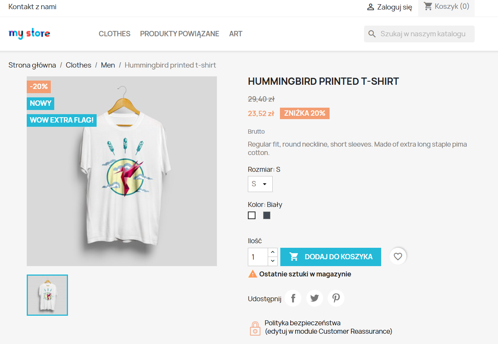
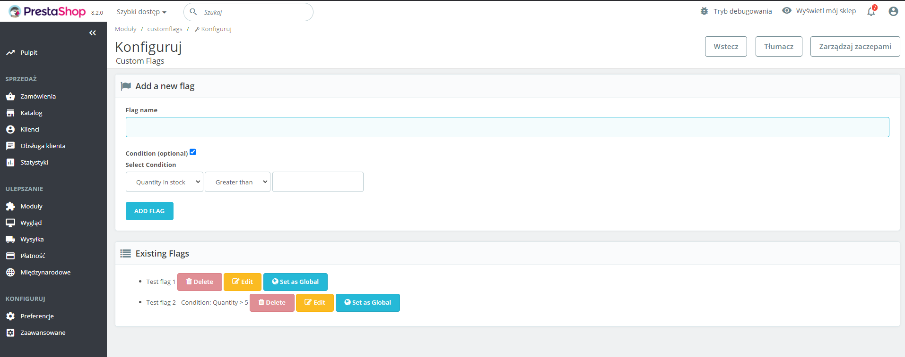
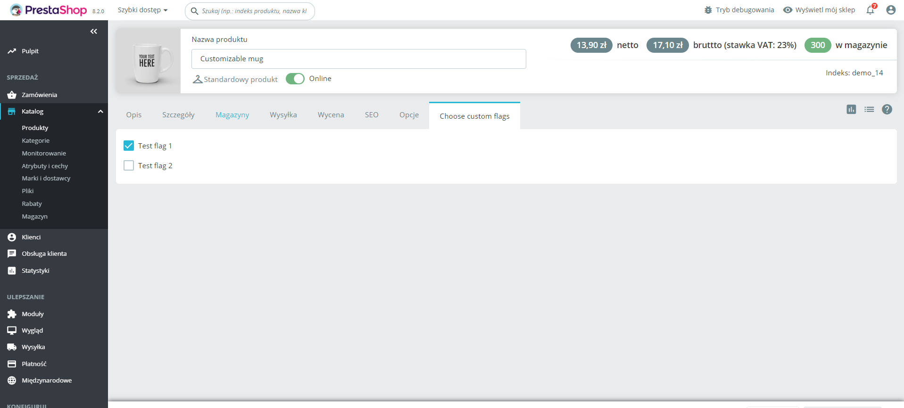
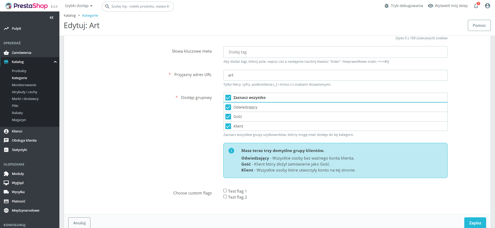

# CustomFlags

Moduł dla PrestaShop umożliwiający dodawanie własnych flag wyświetlanych przy produktach.

Moduł powstał w ramach zadania rekrutacyjnego. Jest to mój pierwszy moduł napisany do PrestaShop.

---

## Instalacja

1. Pobierz najnowszą wersję z sekcji **Releases**.

2. W menedżerze modułów załaduj plik `.zip`, który został pobrany.

---

## Konfiguracja

Na stronie konfiguracji modułu można:

- **Dodać nową flagę**, podając jej nazwę oraz ewentualne warunki wyświetlania (np. stan magazynowy).

- Zarządzać listą już istniejących flag, gdzie każda ma opcje:

  - **Usuń flagę**,

  - **Edytuj flagę**,

  - **Ustaw jako globalną** (przypisanie flagi do wszystkich produktów).

---

## Przypisanie flagi do produktu

Aby przypisać flagę do konkretnego produktu:

1. Otwórz edycję lub dodaj nowy produkt.

2. W sekcji **"Choose custom flags"** zaznacz flagi, które mają być przypisane do produktu.

---

## Przypisanie flagi do kategorii

Aby przypisać flagi do wszystkich produktów w danej kategorii:

1. Otwórz edycję lub dodaj nową kategorię.

2. Na samym dole strony znajdziesz sekcję **"Choose custom flags"**, gdzie możesz wybrać flagi przypisane do kategorii.

---

# CustomFlags

A module for PrestaShop that allows adding custom flags displayed on products.

This project was created as part of a recruitment task. It is my first module developed for PrestaShop.

---

## Installation

1. Download the latest version from the **Releases** section.

2. In the module manager, upload the `.zip` file you downloaded.

---

## Configuration

On the module configuration page, you can:

- **Add a new flag** by providing its name and optional display conditions (e.g., stock availability).

- Manage the list of existing flags, where each flag has options:

  - **Delete flag**,

  - **Edit flag**,

  - **Set as global** (assign the flag to all products).

---

## Assigning a flag to a product

To assign a flag to a specific product:

1. Open the edit page or add a new product.

2. In the **"Choose custom flags"** section, select the flags you want to assign to the product.

---

## Assigning a flag to a category

To assign flags to all products in a category:

1. Open the edit page or add a new category.

2. At the bottom of the page, you'll find the **"Choose custom flags"** section, where you can select flags assigned to the category.
